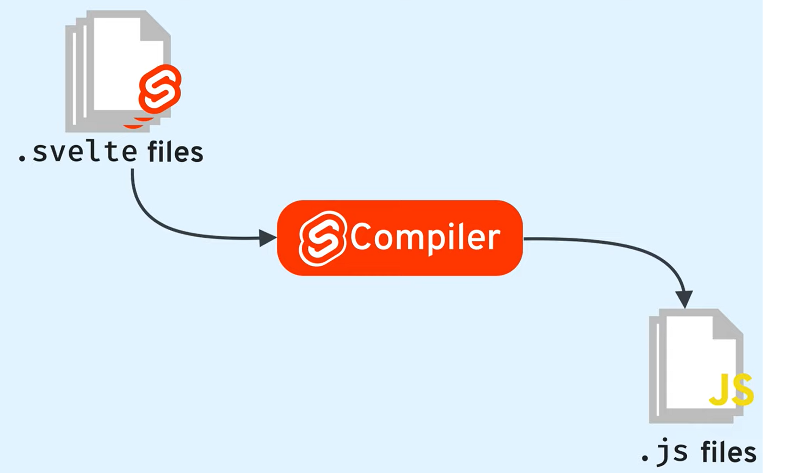

# Svelte

## Overview
- It is a free and open-source front end JavaScript framework.
- Key feature of Svelte
  - It is a compiler.
     
    - It has `no dependencies` for execution.
    - Does not require `Virtual DOM` as all the pre-work is done during compilation.
    - Svelte code is then compiled into `vanilla JavaScript`.
  - Helps to create `component` based web development.
  - It provides as a `small bundle size`.
  - Relies on `Templates` instead of using extension languages like `JSX`.
    - It has good readability as HTML, CSS and JS are available in single `.svelte` file.
    - The structure of `.svelte` file is given below:
      ```html
      <script>
        export let name;
      </script>

      <style>	
        h1 {
            color: purple;
        }
      </style>

      <h1>{name}</h1>
      ```
      - The `script` tag, which is an optional `JavaScript block`.
      - The `style` tag, which is another optional block like a `common HTML style tag`.
      - The `template` block, is only required block that contains `presentation/view` of components.
  - `Reactivity` is built into the language/framework itself.
  - Product grade Svelte Apps can be created using legacy `Sapper` or upgraded `Svelte Kit`.

## History
- It is created by `Rich Harris` and maintained by the `Svelte core team members`.
- Rich Harris created Svelte at `New York Times`. 
  - In `2016`, he started a small project with below:
    - JavaScript compiler that would produce quality code
    - Be light and does not abstraction of the DOM
    - Super-fast loading time 
    - Fast performance
  - In mid-November 2016, he made his first commit
  - Four days later, the first beta is available
  - Ten days after this beta, on `November 26, 2016`, he published a blog [frameworks-without-the-framework](https://svelte.dev/blog/frameworks-without-the-framework)
  - Three days after this blog, `Svelte v1.0.0` was born.
  - With a big cleanup, `v2.0.0` was released in `April 2018`
  - A complete overhaul `v3.0.0` was released in `April 2019`
- Along with Svelte; NYT it is home for creators of `BackboneJS`, `UnderscoreJS`, and `D3`.

## Svelte Conventions
- Svelte converts your app into ideal JavaScript at *build time*, rather than interpreting your application code at *run time*.
- `{}` are used to refer `Javascript variables` inside in the `markup`
  ```html
  <script>
    let name = 'world';
  </script>

  <h1>Hello {name}!</h1>
  ```
- From `Svelte v3.x` system provides `A11y`- Accessibility warnings if inaccessible markups are added.
- If markup attributes are having same name as variables then Svelte supports a `Shorthand attribute` notations.
  ```html
  

  <!-- short attribute notation -->
  
  ```
- `<style>` tag rules are scoped only to the component its defined and will not leak to entire page.
- `import` statement is used to import components from other files and include in current component.
- `{@html }` tag can be used to render HTML directly into a component. Un-trusted sources may lead to XSS attacks.
  ```html
  <script>
	let string = `this string contains some <strong>HTML!!!</strong>`;
  </script>

  <p>This is text - {string}</p>
  <p>This is HTML - {@html string}</p>
  ``` 
- **Reactivity:**
  - Heart of Svelte reactivity starts with defining `events` to update `DOM`. 
    - Svelte enforces use of `on:` directive for declarations; example `on:click`, `on:keyup`, `on:change` 
    - Events actions can be declared in-line using ES6 arrow functions `<div on:mousemove="{e => m = { x: e.clientX, y: e.clientY }}">`
    - **Event Dispatching:**
      - For example, user created a custom button [child component] and any click event of the custom button should be allowed to managed in the child component then this feature is used. 
      - In the child component event should be declared.
      - `createEventDispatcher` can be used to process event on the child and then forward to parent.
      - Example [here](https://svelte.dev/repl/0997c533357447dbb079ba741127852f?version=3.37.0)
    - **Event Forwarding:**
      - For example, user created a custom button [child component] and any click event of the custom button should be allowed to managed in the parent component then this feature is used. 
      - In the child component event should be declared `<button on:click/>` to support Event Forwarding. 
      - Example [here](https://svelte.dev/repl/7a4e815a90434e2d97234750463247ee?version=3.37.0)
    - Svelte supports DOM event modification using below `<button on:click|<modifier>={handleClick}>`
      | Modifier        	| Summary                                                                                   	|
      |-----------------	|-------------------------------------------------------------------------------------------	|
      | preventDefault  	| Calls event.preventDefault() before running the handler.                                  	|
      | stopPropagation 	| Calls event.stopPropagation(), preventing the event reaching the next element             	|
      | passive         	| Improves scrolling performance. Svelte will add it automatically where it's safe to do so 	|
      | nonpassive      	| Explicitly set passive: false                                                             	|
      | capture         	| Fires the handler during the capture phase                                                	|
      | once            	| Remove the handler after the first time it runs                                           	|
      | self            	| only trigger handler if event.target is the element itself                                	|
    - `()` should not be added during function call.
      ```html
      <script>
        let count = 0;

        function handleClick() {
          count += 1;
        }
      </script>

      <button on:click={handleClick}>
        Clicked {count} {count === 1 ? 'time' : 'times'}
      </button>
      ```
  - By default, svelte supports `one-way data binding` for `markup attributes`
    - A new tag `bind` is used to convert any markup attribute binding to two-way data binding.
    - The tag `bind:group` is used to bind values to grouped markup attribute like Radio Buttons, Check Boxes and Dropdowns/Multi Selects.
    - The tag `bind:innerHTML` is used to display html text for elements with a `contenteditable="true"`.
  - Javascript variable update supports `two-way data binding` that are used in `markup`
    - Svelte does not `update result variables` if any `variables part of equation getting updated`. 
    - A new variable definition `$:` is used to make any variable support to two-way data binding.
    - Variable defined using `$:` should always be on left hand side. It will update `DOM` if any variable defined on left hand side is updated.
    - `$:` notation can be used with javascript statements, blocks & if statements.
    - Svelte does not `update array/object variables` if any `functions like push, pop, split are used`.
- **Props:**
  - Properties are used to `pass data from one component to another`.
  - `export` keyword is used to declare props.
  - Initialization of variable is used to `default values` of props.
  - We can map props to object using `spread` operator if the object variables are `having same name as props`.
    ```html
    <!-- Info.svelte --> 
    <script>
      export let name;
      export let version;
      export let speed;
      export let website;
    </script>

    <p>
      The <code>{name}</code> package is {speed} fast.
      Download version {version} from <a href="https://www.npmjs.com/package/{name}">npm</a>
      and <a href={website}>learn more here</a>
    </p>

    <!--App.svelte -->
    <script>
      import Info from './Info.svelte';

      const pkg = {
        name: 'svelte',
        version: 3,
        speed: 'blazing',
        website: 'https://svelte.dev'
      };
    </script>

    <!--Without Spread Operator>
    <Info name={pkg.name} version={pkg.version} speed={pkg.speed} website={pkg.website}/>
    <-->

    <!--With Spread Operator -->
    <Info {...pkg}/>
    ```
- **Statements:**
  - `If/else` statements are used to conditionally display markups
    ```html
    {#if <condition>} 
      <markup>
    {:else if <condition>} 
      <markup>
    {:else }
      <markup> 
    {/if}
    ```
  - `Each` statements can be used to loop an array and display markups. 
    - It also supports descturing `each cats as { id, name }` 
    - We can get index of current record `{#each cats as cat, i}`
    - If user wanted to update specific record. Each provides mechanism to identify records using key attribute `{#each things as thing (thing.id)}`
   ```html
   {#each <array> as <reference>}
    <markup with reference>
   {/each}

   ```
  - `Await` statements can be used to work with promises.
    ```html
    {#await <promise>}
      <p>...waiting</p>
    {:then value}
      <p>The value is {value}</p>
    {:catch error}
      <p style="color: red">{error.message}</p>
    {/await}
    ```


## Modules
- [HelloWorld](https://svelte.dev/repl/845bbc7198b24deebd98c024acd2429f?version=3.37.0)
- [Transform Data - Uppercase](https://svelte.dev/repl/794ef3a55f1249938a0177c49f5bb217?version=3.37.0)
- [Reactivity using FirstName](https://svelte.dev/repl/093ea7c512104574ae008ba75bb2f1fd?version=3.37.0)
- [Reactivity using Arrays/Objects](https://svelte.dev/repl/159a76e0b35743b3b51c1a87b3886238?version=3.37.0)
- [Event Dispatching](https://svelte.dev/repl/0997c533357447dbb079ba741127852f?version=3.37.0)
- [Event Forwarding](https://svelte.dev/repl/7a4e815a90434e2d97234750463247ee?version=3.37.0)
- [HTML REPL](https://svelte.dev/repl/c9b4b28b689a497dbf1182fb871ca5e0?version=3.37.0)
- [HTML Page Generator](https://svelte.dev/repl/b6917b52facb41acb72cacc1912cca96?version=3.37.0)

## Appendix
- [Svelte Kit](https://svelte.dev/blog/whats-the-deal-with-sveltekit)
- [Rich Harris What-is-svelte](https://gist.github.com/Rich-Harris/0f910048478c2a6505d1c32185b61934)
- [svelte.dev](https://svelte.dev/tutorial/basics)
